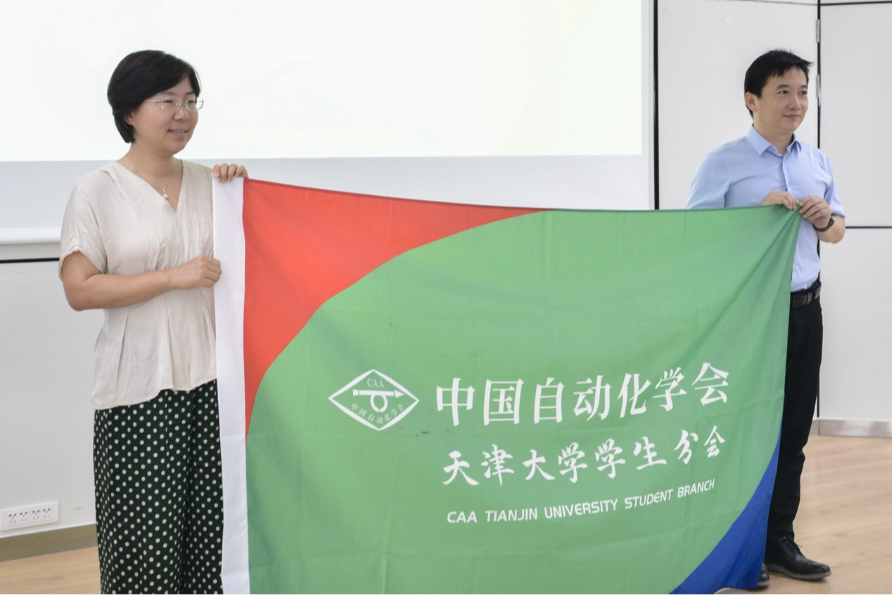
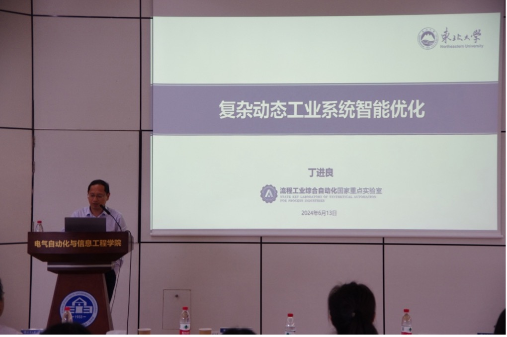
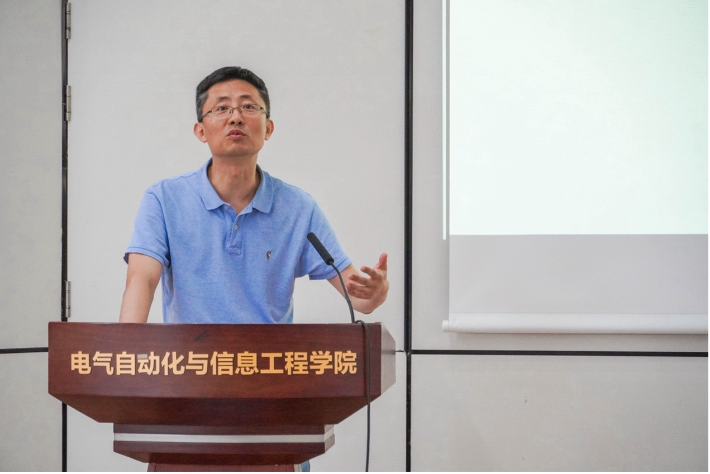

青年科技人才是我国科技事业发展的中坚力量。习近平总书记在中央人才工作会议上指出“要造就规模宏大的青年科技人才队伍，支持青年人才挑大梁、当主角”。在高度重视青年人才培育的战略布局下，强化“科教兴国、人才强国”的国策方针，中国自动化学会积极响应国家号召，将学会培育青年人才的责任工作拓宽下沉，在全国高校试点成立学生分会。

中国自动化学会天津大学学生分会成立大会合影留念

2024年6月13日上午，中国自动化学会天津大学学生分会成立大会暨天津市智能无人集群技术与系统重点实验室前沿论坛在天津大学卫津路校区SEIE报告厅顺利举行。本次会议由中国自动化学会主办，天津大学电气自动化与信息工程学院承办。中国自动化学会副理事长王成红研究员，中国自动化学会秘书长张楠、副秘书长王坛，会议邀请了青岛大学侯忠生教授，上海交通大学张卫东教授；华东师范大学李韬教授；东北大学丁进良教授以及清华大学孟子阳教授出席本次前沿论坛。天津大学电气自动化与信息工程学院院长谭超教授、董峰教授本次会议。出席会议的还有天津大学电气自动化与信息工程学院的教师和学生代表。成立大会由天津大学自动化系主任胡超芳教授主持。

成立大会在天津大学SEIE报告厅召开

天津大学自动化系主任胡超芳教授主持会议

会议伊始，中国自动化学会会士、副理事长王成红研究员致开幕辞，明确中国自动化学会天津大学学生分会的成立宗旨，鼓励自动化学子积极参与学术与科研活动，为中国自动化学会和中国自动化领域做出更大的贡献。随后，中国自动化学会秘书长张楠宣读《关于同意CAA天津大学学生分会召开成立大会的批复》，并宣读候选人名单。最后，天津大学电气自动化与信息工程学院院长谭超作为院领导致辞，明确这次大会的主要任务和分会建设，表示对学会活动学院将大力支持，并对天津大学学生分会的未来发展寄予厚望。

王成红副理事长致辞

张楠秘书长宣读《关于同意中国自动化学会天津大学学生分会召开成立大会的批复》

谭超院长致辞

秉承公平、公正、公开的原则，大会组织中国自动化学会学生代表投票选举中国自动化学会天津大学学生分会执行委员会成员。统票结束后，总监票人宣读选举结果，院长谭超教授公布中国自动化学会天津大学学生分会指导委员会和第一届执行委员会名单。

会员上台投票选举执行委员会成员

谭超院长宣布选举结果

随后，中国自动化学会秘书长张楠向天津大学电气自动化与信息工程学院院长谭超教授授予会牌、会旗，并为中国自动化学会天津大学学生分会首届指导委员会与执行委员会成员颁发聘书。

中国自动化学会天津大学学生分会授牌仪式

中国自动化学会天津大学学生分会授旗仪式

张楠秘书长为首届中国自动化学会天津大 学学生分会指导委员会成员颁发聘书

张楠秘书长为首届中国自动化学会天津大学学生分会执行委员会成员颁发聘书

第一届中国自动化学会天津大学学生分会候任主席高静宇进行就职宣誓。指导委员会委员左志强教授致闭幕辞，对与会的领导表示了崇高的敬意和衷心的感谢，并表示将不遗余力地为全校学生会员搭建一个充满活力、富有创新的青年学生交流、学习、成长、展示自我的平台。至此，此次中国自动化学会天津大学学生分会成立大会圆满闭幕，中国自动化学会天津大学学生分会正式成立。

首届中国自动化学会天津大学学生分会候任主席高静宇进行就职宣誓

左志强教授作天津市智能无人集群技术与系统重点实验室介绍

随后，天津市智能无人集群技术与系统重点实验室前沿论坛隆重召开，五位专家展开了精彩的报告，吸引了大量老师和学生参会。IEEE Fellow, 中国自动化学会会士，青岛大学系统科学研究院院长侯忠生教授以《控制理论研究中的范式转移》为题，首先介绍控制理论研究中的范式概念以及相关内容，随后介绍数据驱动控制的定义和动机目的。紧接着以无模型自适应控制为例，介绍如何设计数据驱动控制系统。

青岛大学侯忠生教授作大会报告

上海交通大学，上海高校船舶自动化工程研究中心主任、海洋智能系统教育部工程研究中心主任张卫东教授开展《船舶海洋装备智能与绿色技术发展方向》的报告，介绍了团队如何围绕智能与绿色船舶开展的研究工作，分析了系统存在的关键问题和挑战，演示了技术验证结果，展望了未来的技术应用前景。

华东师范大学的上海国家应用数学中心多智能体信息物理系统研究团队负责人李韬教授报告了《基于非平稳数据流的分布式学习》，基于非平稳数据流和随机图序列的“共识+新息”型分布式估计算法的收敛性，建立了保证算法收敛的“随机时空激励条件”。

华东师范大学李韬教授作报告

东北大学流程工业综合自动化国家重点实验室副主任，中国自动化学会常务理事丁进良教授提出现代流程制造系统已普遍发展成为由多个设备/单元相互耦合的多层次动态生产系统的观点，作《复杂工业过程建模与优化》的报告。解释了现代流程制造系统作为国家支柱产业的流程制造业迈向智能化是后工业时代的必然选择，其智能化的核心是如何实现提质减碳增效多目标优化，本质上是复杂非线性动态系统优化的科学难题。

东北大学丁进良教授作报告

清华大学的国家高层次人才计划，科技创新领军人才孟子阳教授介绍了《人工智能驱动的自主导航技术研究进展》，分享了人工技术推动无人系统发展与应用的情况。

清华大学孟子阳教授作报告

中国自动化学会天津大学学生分会指导委员会委员左志强致成立大会闭幕词

未来，学生分会将在中国自动化学会和天津大学的共同支持下，基于天津市智能无人集群技术与系统重点实验室的平台，不断开拓创新，积极促进学术交流，营造良好的学术科研氛围，进而激发同学的科研灵感，推动自动化领域的发展。