随着航空航天技术的飞速发展，临近空间特有的战略意义使得各国开始重视并加大其开发和应用力度。未来空天武器装备体系的重要作战空间，未来临近空间科技“高地”之争将会愈演愈烈。临近空间在远程打击、侦察监视、综合预警、通信中继、对地遥感等方面有着广泛的应用领域和发展前景，已成为未来战争激烈争夺的主战场和支撑经济社会发展的增长极。

项目组针对临近空间无人飞行器集群化能源系统的协同控制、能量调度以及故障诊断等问题开展研究，实现能量平衡、功率平衡、储能均衡以及能流高效四个目标。已在国内外期刊上发表学术论文40余篇，其中包括 IEEE Transactions on Automatic Control（长文）、Automatica 等多篇控制领域高水平论文，申请发明专利20余项。

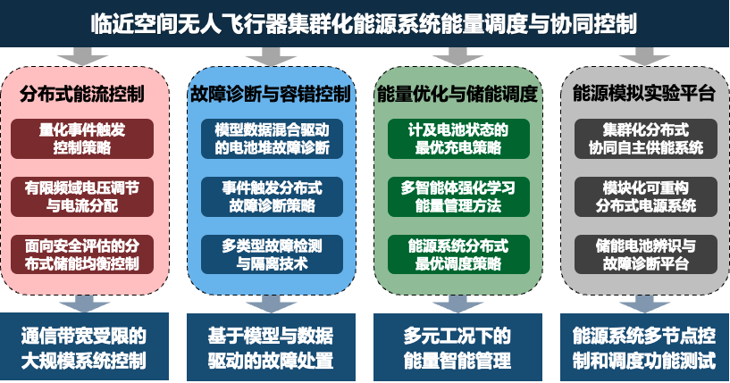

主要研究方向

## 集群化能源系统的分布式协同控制

针对太阳能飞行器中的分布式能源系统所面临的功率受限、通信受限等多重约束以及参数不确定等问题，项目组提出了一种全分布式的控制策略来同时解决储能均衡和功率平衡问题。所提出的分布式控制器在负载、线路阻抗和通信网络等全局信息未知的情况下仍可运行，具有即插即用的能力，便于能源系统的模块化扩展。通过事件触发条件设计与有限时间/固定时间控制策略设计，有效解决了多约束共存的机载能源系统协同控制问题。同时为了避免多模组电池环流，创新性地通过调节供给公共负载的输出功率来实现能源系统的功率均衡，从而有效提高了充电效率和电池寿命。

（1）量化事件触发控制策略：飞行器通讯设备需要在保证安全航行的前提下，对能源系统各种设备实现精细化控制，能源网络通讯表现为带宽低和交互不连续，通过量化和触发的手段来降低通讯资源占用。提出量化依赖的同步/异步事件触发机制，同时减少传输次数和单次传输字节数，解决了信道资源受限问题。设计量化时滞事件触发控制策略，保证能源系统各节点电池荷电状态实现均衡。

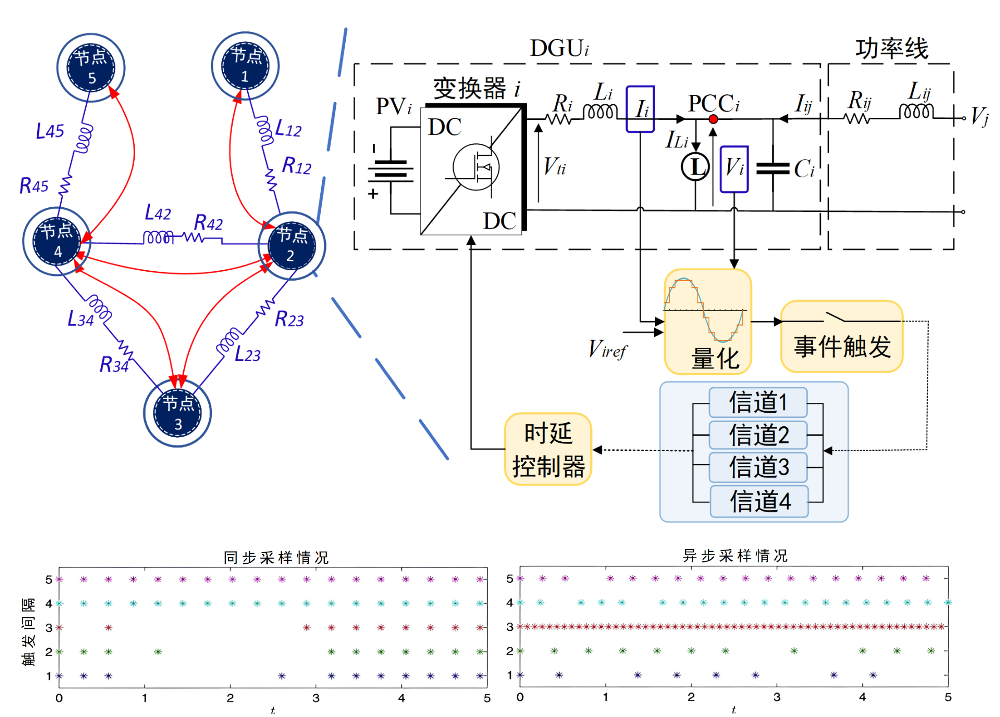

同步/异步动态量化与事件触发策略

（2）有限频域电压调节与电流分配：由于临近空间航行环境复杂多变和飞行器载荷能力的限制，使得光伏发电能力不稳定、能源供应需求不确定，亟待构建一种具备高度鲁棒性的电压电流控制策略，以充分适应临近空间飞行任务的特殊运行需求。建立基于 Boost 拓扑的小信号模型，分析负载变化，输入电压扰动，器件参数不确定性对稳压效果的影响，同时利用扰动信号的有限频域信息和启发式算法设计鲁棒 H∞ 控制器，实现能源节点电压调度与电流分配。

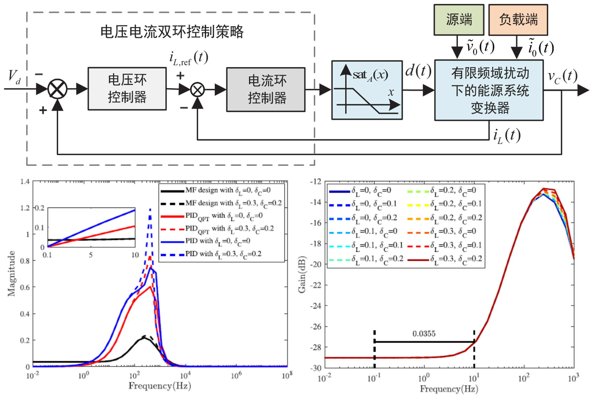

多频扰动下的电压调节与电流分配框架

（3）单母线能源系统固定时间分布式控制：由于临近空间飞行器受到的光照强度不均匀，使得光伏发电量存在一定的差异性，需要设计一种复杂度低、具有快速收敛速度的分布式控制策略以均衡不同节点的能量。提出了一种能够降低实施复杂性并提高系统动态性能的单层控制结构形式的固定时间分布式控制策略，实现了电压调节和比例功率分配误差的快速动态响应。

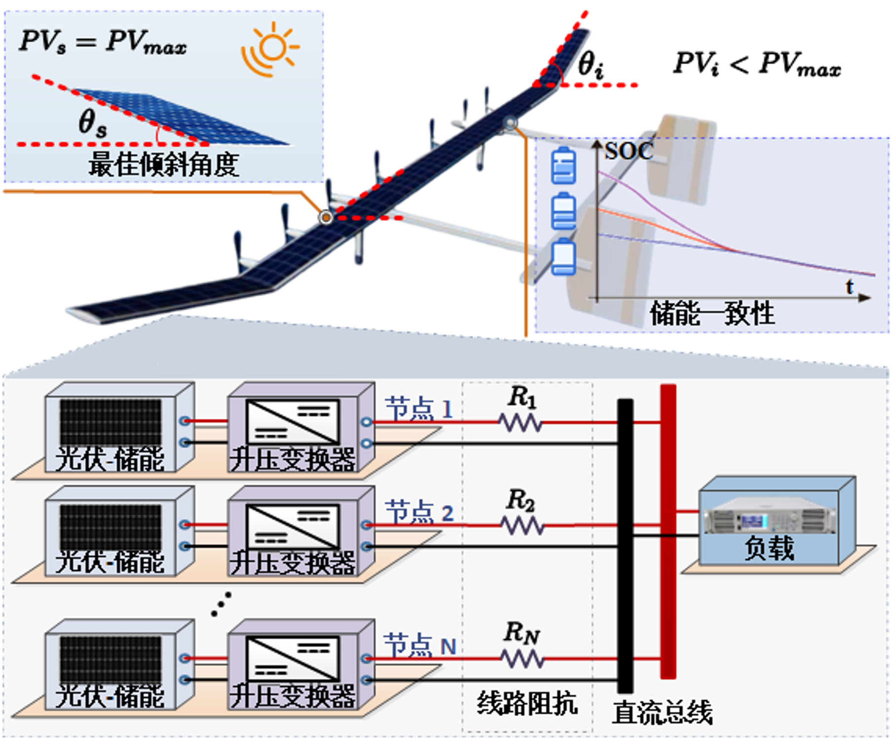

并联式能源系统固定时间下的调压均流

（4）面向安全性评估的分布式储能均衡控制：由于飞行器负载的不确定性，在多节点分布式能源系统进行功率分配实现储能均衡过程中，会出现一定程度的电压偏差，使得系统处于不稳定的危险状态。针对分布式能源系统提出了一种分布式储能状态均衡控制策略，在基于等效模型推导的安全区域边界条件内，单个节点只借助邻居节点荷电状态信息对自身输出功率进行控制，实现系统各节点储能均衡。

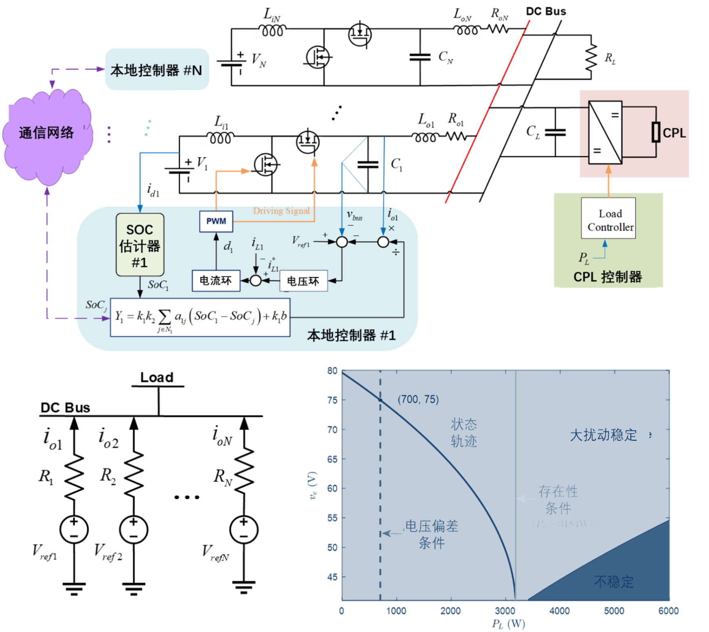

分布式储能控制策略与安全边界条件

## 能源系统的主、被动容错控制

（1）模型数据混合驱动的电池堆故障诊断：恶劣的工作环境使得电池管理系统容易发生各种故障，单一传统故障诊断方法无法应对多耦合故障场景，因此需要模型数据混合驱动策略，对存在耦合的故障进行有效识别。针对多物理场耦合问题，建立了储能电池堆热电耦合模型，分析了不同故障类型间的耦合关系及相互影响机理，借助自适应 Kalman滤波与核学习技术设计故障诊断策略，实现电池传感器故障估计和电池内阻故障的识别。

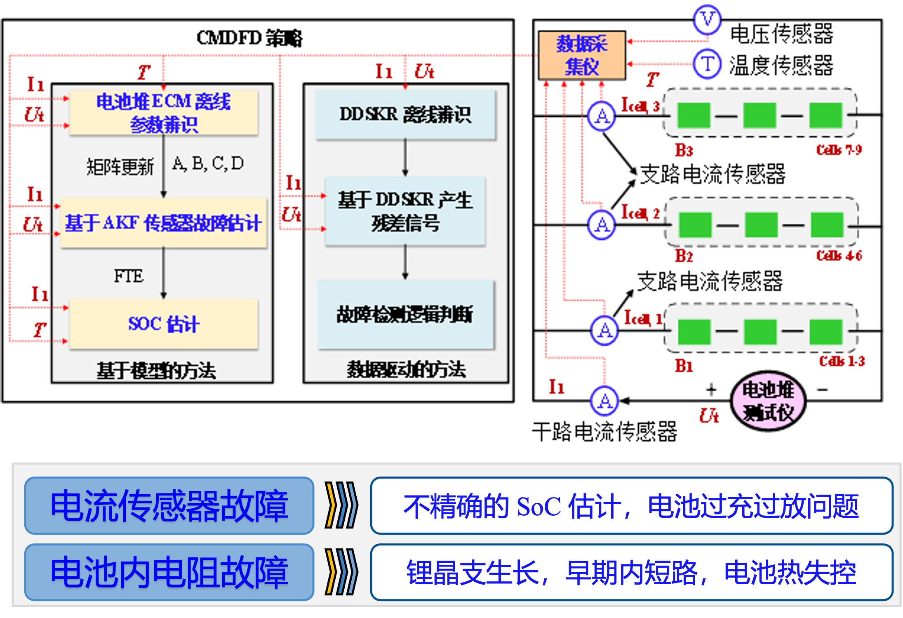

面向传感器和电池内阻故障的诊断策略

（2）事件触发分布式故障诊断策略：长航时工况下临近空间无人飞行器自身比能量和比功率的严格要求使得机上通信资源严格受限，这给飞行器分布式能源系统故障节点的及时检测和精准定位带来巨大挑战。考虑通信资源受限问题，设计了自适应事件触发机制来减少各个能量节点间的通信次数，提出了事件触发分布式区间观测器来实现故障节点的检测与定位。

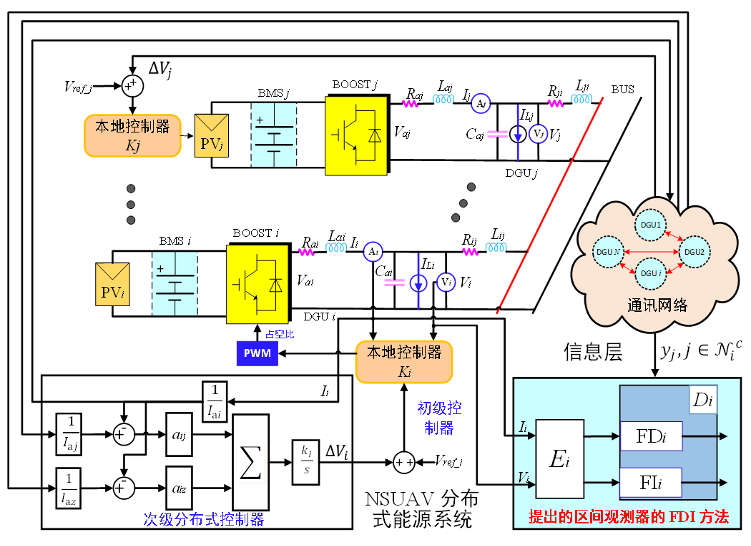

事件触发分布式故障检测与定位技术

（3）多类型故障检测与隔离技术：飞行器的长航时运行特性增大了能源系统各部件的故障风险，发现并隔离故障，最大程度地减小故障对飞行器的影响，需要采用快速高可靠故障检测和隔离策略。针对执行器、传感器和元器件可能存在的故障，融合基于模型残差生成方法与数据驱动的间隙度量技术，完成对系统不同层级的故障诊断，并进一步实现故障隔离与容错，提高系统安全性。

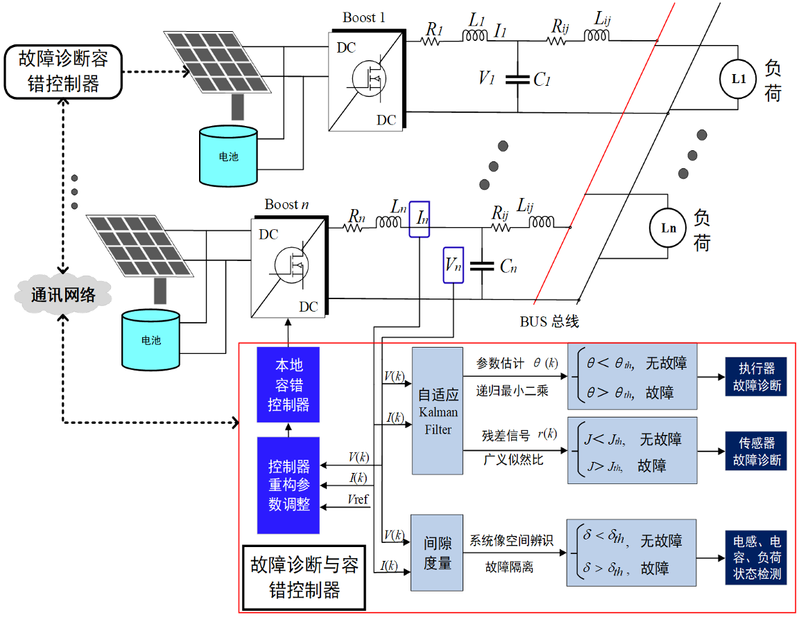

分布式能源系统的故障检测与隔离框架

## 集群化能源系统的能量优化调度

针对机载能源系统容量受限及长航时需求，项目组提出了多智能体深度强化学习的自主能量优化调度策略。构建了包含飞行器航行环境、光伏、储能以及负载的动态模型，在与环境的不断交互过程中，探索最优的自主调度策略，有效提升不同任务工况下的供电能力。建立了储能电池的电-热-老化耦合模型，并通过奖励函数和多类型动作空间的设计提升了充放电速度及电池健康状态，突破了储能单元循环次数限制飞行时长的瓶颈问题。此外，在能量调度中考虑了DC-DC变换器及能流传输损耗，保证系统在各种工作状态下的稳定性与高效性。

（1）计及电池状态的最优充电策略：长航时飞行过程中储能电池会昼夜循环充放电，为避免电池过度老化以及提高单次充电速度，需要对电池内部特性进行研究，并提出一种飞行器能源系统适用的充电方法。建立锂电池电-热-老化耦合模型，并设计一种多阶段的组合充电策略，借助充电焦虑度、电池健康度和能量效率的指标，计算适合当前日期位置的充电策略，在提高充电速度的同时，尽可能降低电池老化速度。

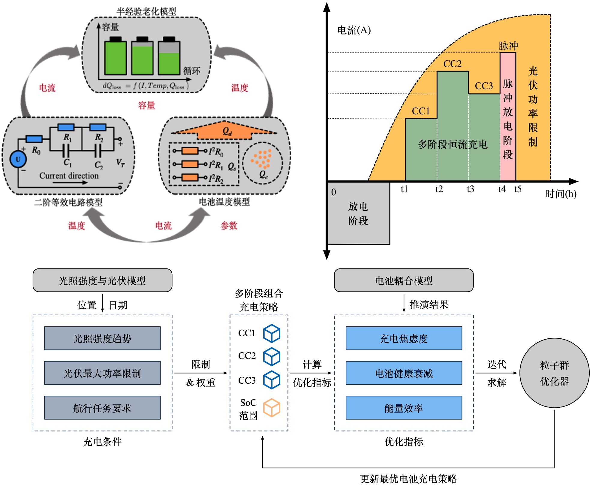

电池耦合模型与多阶段充电策略优化流程

（2）基于多智能体强化学习的能量管理方法：在太阳能飞行器的场景中，存在大量的电池组分布在不同的储能模块上，由于发电和用电功率的差异性，很容易导致不同储能单元的 SoC 不均衡和 SoH 差异，影响飞行可靠性。基于飞行器能源系统拓扑建立储能环境，设定多目标优化机制，通过多智能体深度确定策略梯度方法完成集中训练和分散执行，实现能量平衡和储能高效的目的。

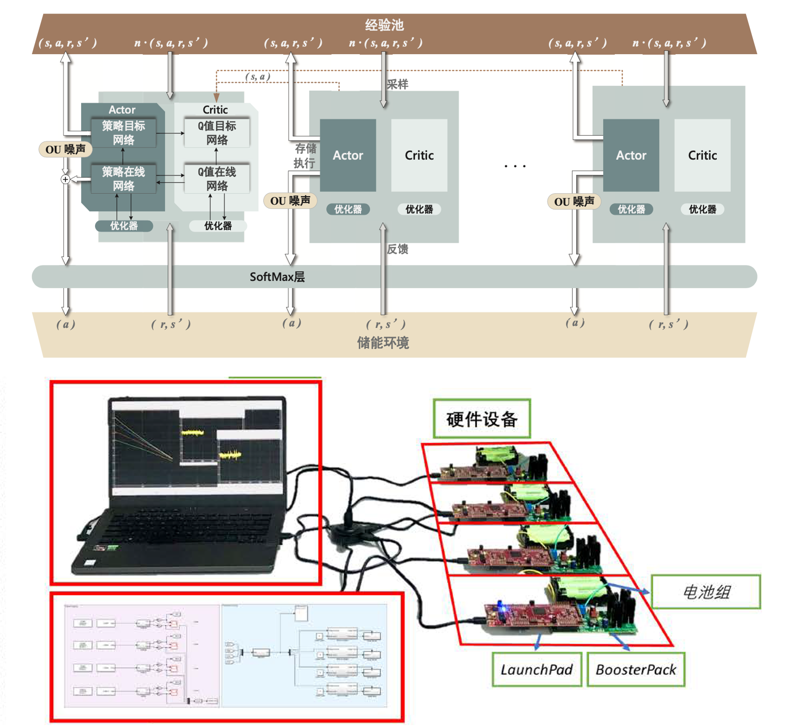

面向多储能节点 SoC 均衡的能量管理方法

（3）能源系统分布式最优调度策略：在容量受限的飞行器能源系统中，最小化能流损耗是实现“节流”的关键手段。在负载波动的情况下，通过分布式方法求解和跟踪系统损耗最小的工作点，是能源系统调度与控制的重要任务。针对负载波动情况下能源系统的均流和电压调节问题，同时考虑变换器和线路损耗，提出了分布式优化控制策略，实现系统在最优工作点运行。进一步，通过电流软约束和基于投影的电压有界控制策略保证了系统的安全稳定。

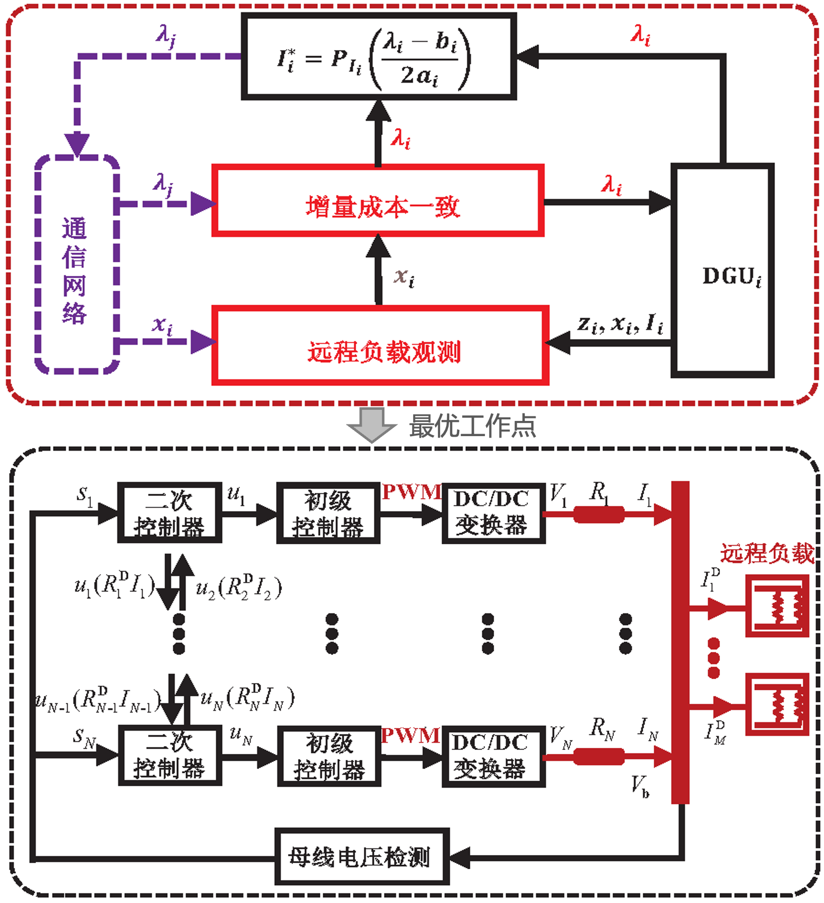

能源系统分布式最优调度策略

## 临近空间飞行器能源模拟实验平台

本项目构建了一套临近空间无人飞行器能源系统实验平台，形成了不同环境和任务工况下能源系统控制与调度性能指标的分析与测试能力。所用技术已应用于北京航空航天大学的25m翼展太阳能无人机以及蔚蓝空间飞行器有限公司的某型号临近空间太阳能无人飞行器中。本项目同时支撑了2021年度天津市科学技术进步一等奖、天津市智能无人集群技术与系统重点实验室和天津大学-工程硕士-智能电源系统研发与测试基地的建设。

（1）模块化可重构分布式电能源系统：项目组研发的模块化可重构分布式电能源系统如图1所示。系统采用分层模块化、一体化集成的设计架构，构建了以光伏功率控制模块和、储能单元以及功率输出模块为基本单元的可重构分布式电能源系统，节点间采用CAN总线进行信息交互，具备标准接口和宽输出电压范围，满足临近空间运行环境需求。系统具备拓扑重构能力，串并联方式可软件重定，可根据故障状态和发/用电情况进行拓扑重构。经测定，系统功率密度达1500W/kg，电能转换效率达96%，软件定义拓扑重构时间不超过1ms。

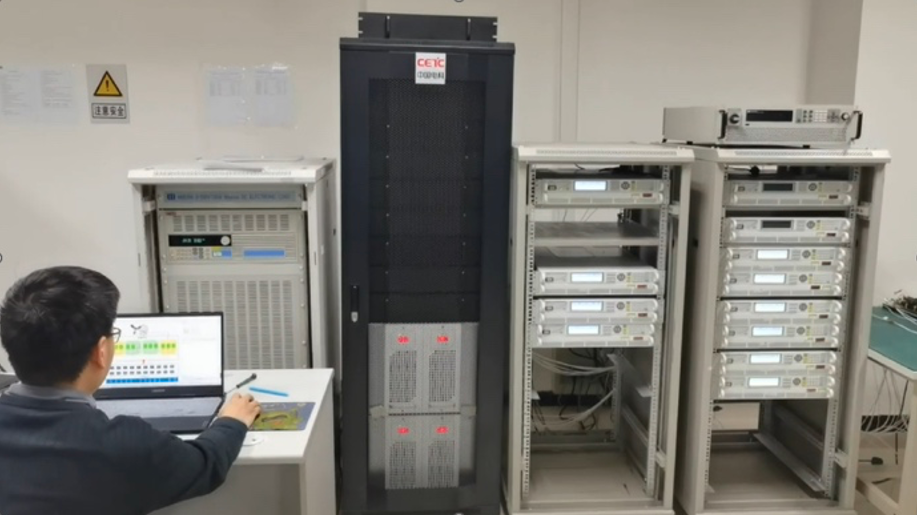

模块化可重构分布式电能源系统

系统从两个方面取得了突破：一是进行功率调节模块一体化集成设计，实现系统、设备、部件的通用化和集成化；二是采用分层架构体系控制，将电源系统功能进行分层，采用软件定义的方式实现各层功能和系统总体要求。通过采用功能模块一体化集成设计，开放和统一的体系架构，模块化的硬件和可自主定义的软件，减少了模块电源的体积、重量，功耗等开销，提高能源系统的可靠性、安全性，满足未来可持续升级、可灵活配置的需求。

（2）临近空间飞行器能源模拟实验平台

项目组研发了一套能源系统智能调度实验平台，如图2所示。系统由模块化分布式电源系统，发/用电模拟器，多维工况仿真系统以及监控系统构成，通过多维工况仿真建立不同任务场景下的能量发-用功率，通过数字大屏和监控软件对系统拓扑和控制系统参数的全维度运行状态进行实时监控，评估系统性能指标。经测试，能量最优调度策略实现了能源系统连续180昼夜的可靠运行。

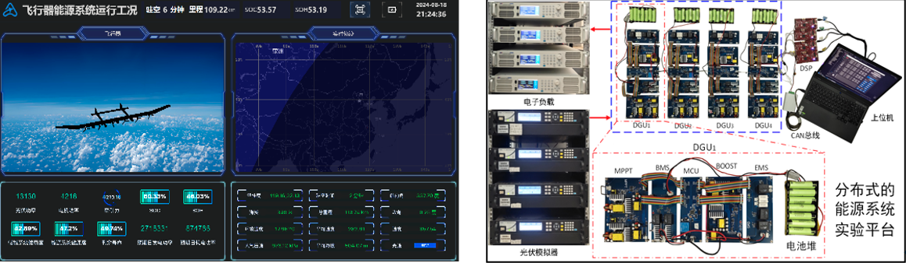

能源系统智能调度实验平台

系统从两个方面取得了突破：一是形成了形成从航迹、环境因素、能量获取与管控、载荷用电模型到飞行器动力学的全过程仿真的实验环境，反映了能源供给与存储系统、动力系统与负荷设备、能源管理系统等之间的连接及耦合关系，为多种环境工况下的系统测试提供有力支撑。二是构建了基于全国产化决策核心的机载能源管理器，实现了机器学习算法的部署和应用。该测试实验平台的建成填补了临近空间飞行器能源系统多物理场模拟仿真与调度策略验证的空白，对控制调度策略验证、安全运行边界分析、以及任务驱动的控制协议再设计提供了坚实的实验基础。

项目建立一套分布式能源系统，并给出稳定性分析方法与安全性评估体系，提出分布式控制策略，解决了分布式能源系统的稳定运行与协同控制问题。本项目的研究成果已成功应用于我国部分临近空间太阳能无人机，显著提升了其飞行性能和任务执行能力。根据某型临近空间太阳能无人飞行器用电情况进行测定，功率分配调节时间降低了71.5%，充电时间降低了13.71%，通信带宽占用降低了85.5%，电压调节误差不超过1%。表明该系统在能流调控、储能管理、机载资源占用以及供电稳定性等方面均满足预期要求。在实际测试中，太阳能无人机在实际飞行任务的考核过程中工作良好，电性能稳定，该产品的成功应用极大地推动了我国军、民用临近空间无人飞行器能源技术的发展，具有十分可观的经济效益、社会效益和军事效益。