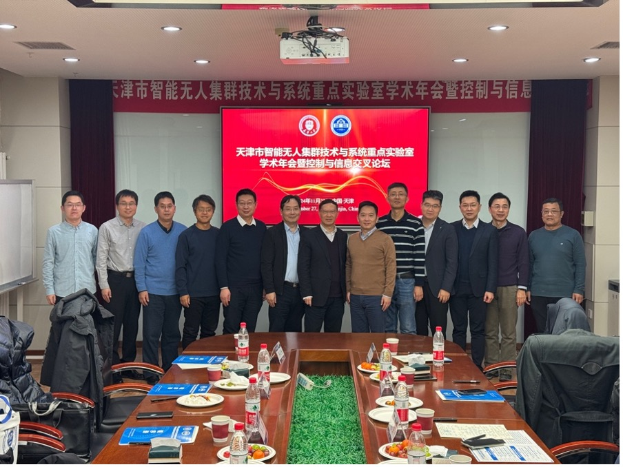
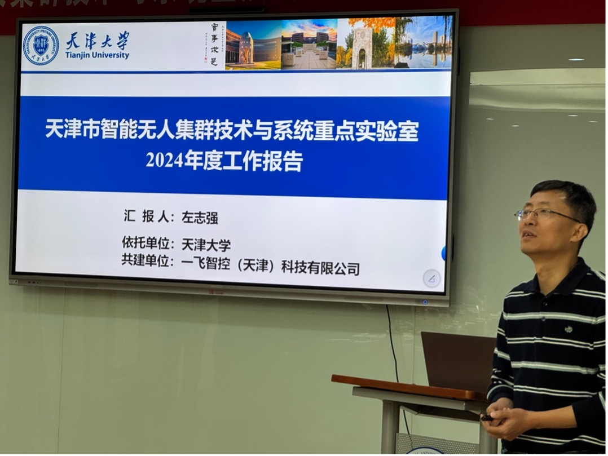
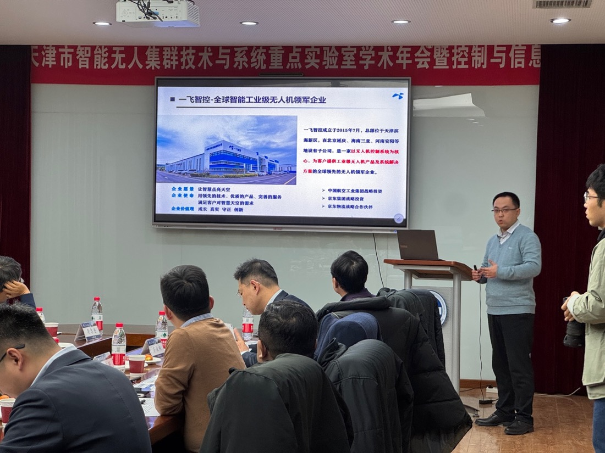
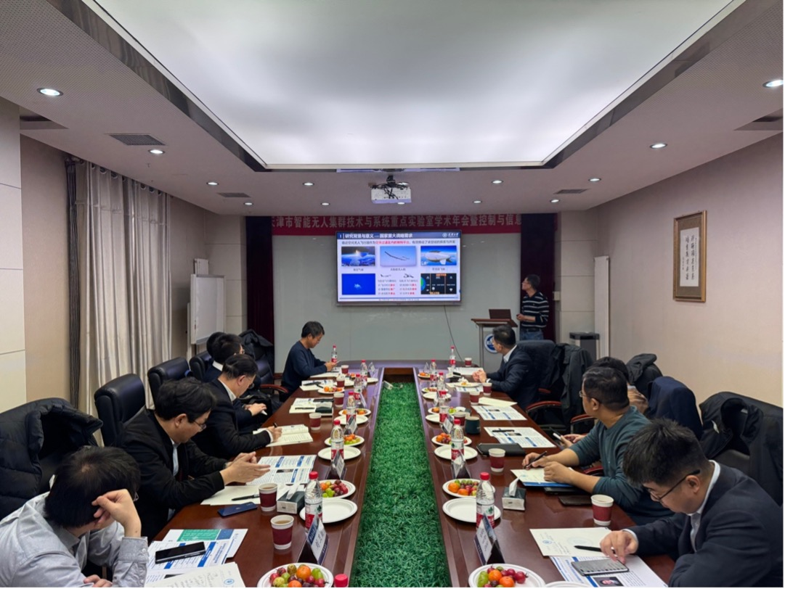
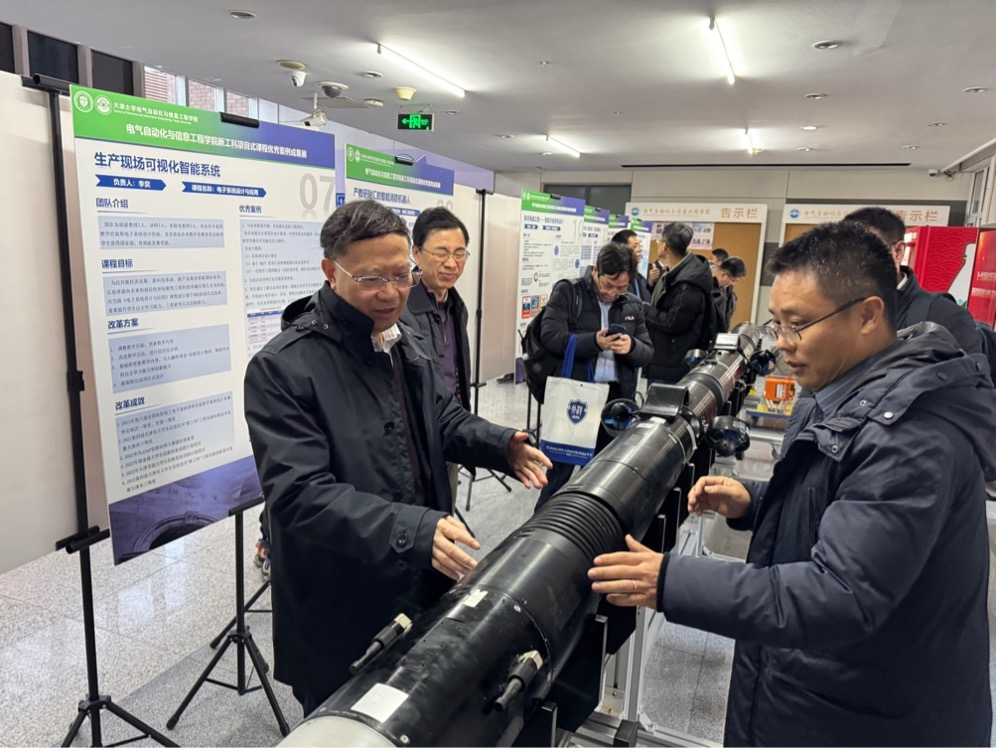
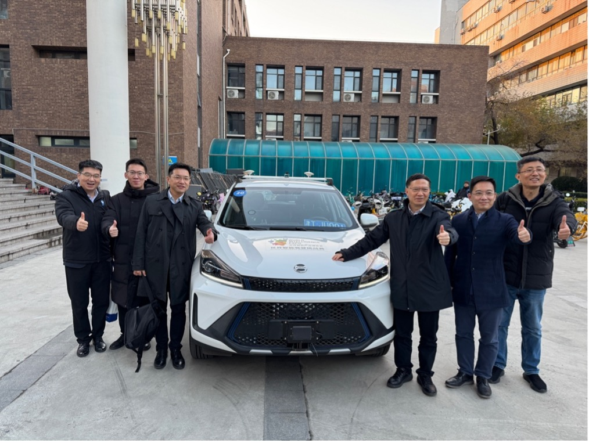
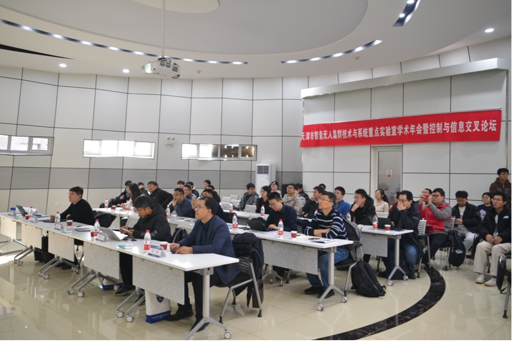
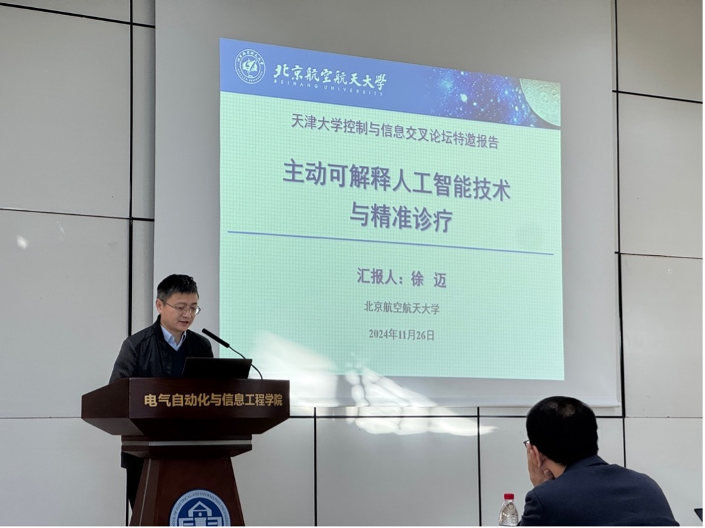
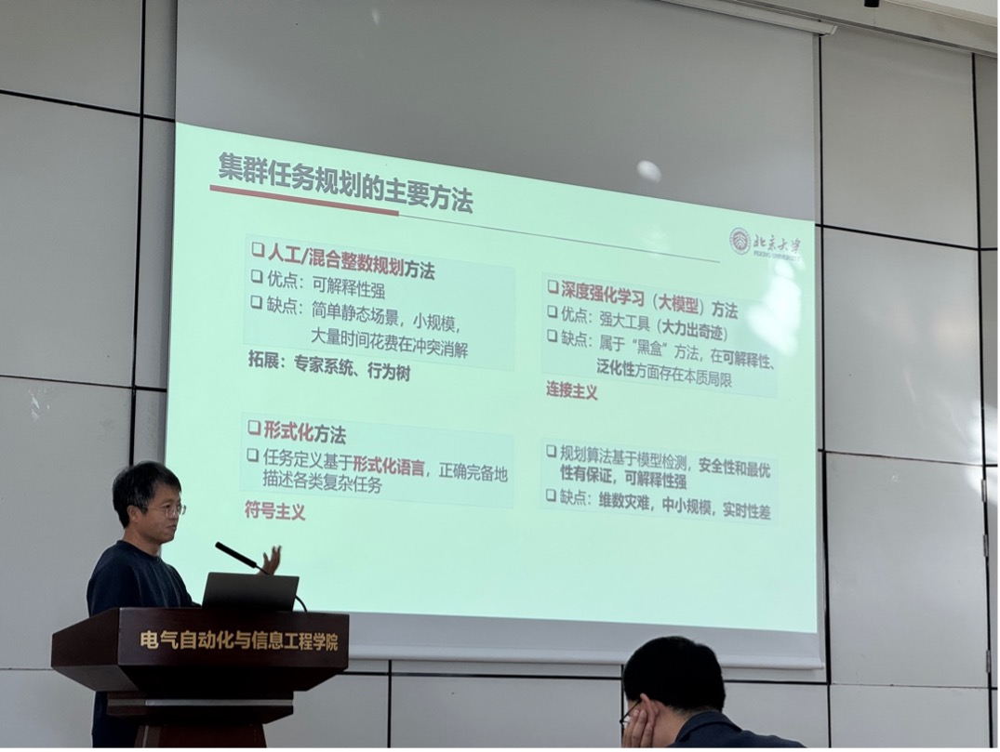
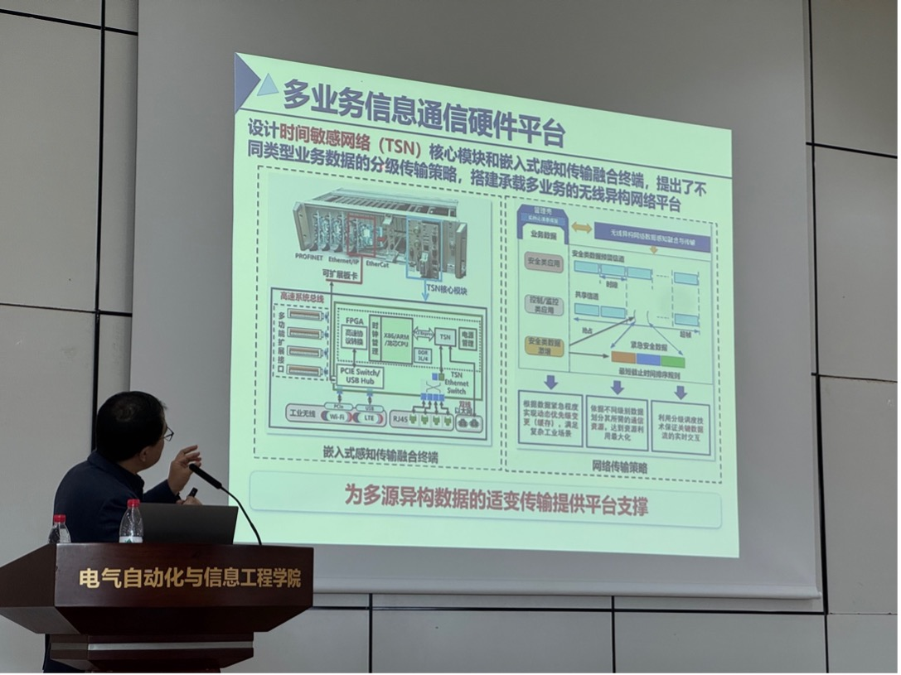

2024年11月27日，天津市智能无人集群技术与系统重点实验室学术年会暨控制与信息交叉论坛分别在天津大学召开。
天津市智能无人集群技术与系统重点实验室2024年度学术年会在天津大学卫津路校区第26教学楼E区236室召开，学术委员会主任王耀南院士主持会议，孙永斌教授、天津大学齐俊桐教授、北京大学李忠奎教授、河北工业大学刘卫朋教授、南开大学张雪波教授、天津工业大学夏承遗教授、天津大学孟庆浩教授、天津大学胡超芳教授作为重点实验室学术年会委员出席，天津大学电气自动化与信息工程学院领导及实验室部分教师和研究生参加了会议。

天津市智能无人集群技术与系统重点实验室2024年度学术年会合影留念

会上，天津市智能无人集群技术与系统重点实验室主任左志强教授首先对2024年度的工作进行了全面的总结报告。报告内容涵盖了实验室在过去一年中的主要科研成果、项目进展、团队建设以及资源管理等方面的情况。主任详细介绍了实验室在无人机技术、能源系统以及协同控制等领域取得的突破性进展，并对各项目的完成情况进行了评估。同时，主任还对团队成员的工作表现给予了肯定，并指出了在资源配置和项目管理方面存在的不足，提出了改进措施和未来的发展方向。

左志强教授作天津市智能无人集群技术与系统重点实验室主任2024年度工作报告

一飞智控副总经理王子峰就“无人机集群控制技术在低空经济产业中的应用情况”进行了深入的学术报告。王副总经理详细阐述了无人机集群在物流配送、农业监测、环境保护等低空经济领域的实际应用案例，分析了当前技术面临的挑战和未来的发展趋势。他还分享了一飞智控在无人机集群控制算法、通信技术以及安全保障方面的最新研究成果，并与在场的科研人员进行了互动交流，解答了大家的疑问。

一飞智控（天津）有限公司副总经理王子峰作工作报告

天津大学左志强教授带来了题为“临近空间太阳能无人飞行器能源系统能量调度与协同控制”的学术报告。左教授介绍了临近空间太阳能无人飞行器的能源系统设计理念，重点讲解了能量调度策略与协同控制方法在提高飞行器续航能力和任务执行效率方面的重要性。他结合具体的实验数据和模拟结果，展示了其团队在能源管理优化、系统集成以及多飞行器协同控制方面取得的研究成果，并探讨了未来在该领域的研究方向和潜在应用。
 

天津大学左志强教授作工作报告

在两位专家的报告结束后，会议进入讨论环节。与会成员针对实验室2024年度的工作总结展开了热烈的讨论。大家就科研项目的进展、团队协作、资源配置以及技术创新等方面提出了自己的看法和建议。与会委员充分肯定实验室在2024年度取得了突出成绩，并建议实验室人才培养、科学研究与学科建设一体化推进。针对未来的工作，参会人员一致认为应继续加强与企业和高校的合作，提升科研项目的应用转化能力；加大对新兴技术领域的投入，尤其是在无人机集群控制和能源系统优化方面；优化团队结构，提升成员的专业能力和协作效率。此外，建议实验室在未来的工作中注重国际交流与合作，拓展科研视野，提升实验室的整体竞争力。

会后，与会专家参观了天津大学电气自动化与信息工程学院实验室场地与科研设施，并就无人集群、智能控制与综合能源系统等方面展开激烈的讨论。

王耀南院士参观学院科研平台

王耀南院士等与会专家与实验车合影留念

控制与信息交叉论坛在天津大学卫津路校区第26教学楼SEIE报告厅召开，邀请了北京航空航天大学徐迈教授、北京大学李忠奎教授、中国科学技术大学刘武教授和燕山大学马锴教授作学术报告，天津大学电气自动化与信息工程学院左志强教授、田栢苓教授、孙彪教授和董娜教授作主持，围绕人工智能、无人集群以及综合能源系统展开了丰富且激烈的学术讨论，吸引了学院近百名老师和同学前来学习。

控制与信息交叉论坛现场照片

北京航空航天大学徐迈教授发表了题为《主动可解释人工智能技术与精准诊疗》的学术报告，介绍了其团队在将人类医学诊断的先验知识有机融入深度神经网络方面的研究工作，分析了深度学习在智慧医疗应用中面临的主要挑战，最后展望了主动可解释人工智能技术的发展趋势。

北京航空航天大学徐迈教授作报告

 
北京大学李忠奎教授作《无人集群任务规划与行为协同技术进展》的报告，介绍了近年来在无人集群形式化任务的超快速与可解释规划，以及在线轨迹生成的死锁预警与破解等关键技术上的研究进展，并指出未来无人集群在军事防务、灾害救援、环境监测等多个领域的重要的作用。

北京大学李忠奎教授作报告

中国科学技术大学刘武教授发表了题为《数字人体3D模型重建与动作生成技术进展》的报告，指出人体3D模型重建、渲染和动作生成技术已成为学术界和工业界的热点关注点，介绍了团队在单个相机下高效率、高鲁棒性地重建多人拥挤环境中的人体三维模型，精确捕捉人体动作信息，以及基于文本大模型快速生成新的人体动作序列等关键技术方面的研究进展。

燕山大学马锴教授详细介绍了信息物理融合能源系统在协调控制与优化方面的最新研究进展，报告从分布式电源与温控负荷的协调控制方法、考虑用户舒适度的经济优化调度与博弈定价策略和能源系统的适配信息传输机制三个方面研究，最后对信息物理融合能源系统在绿色港口中的应用前景进行了展望。

燕山大学马锴教授作报告
